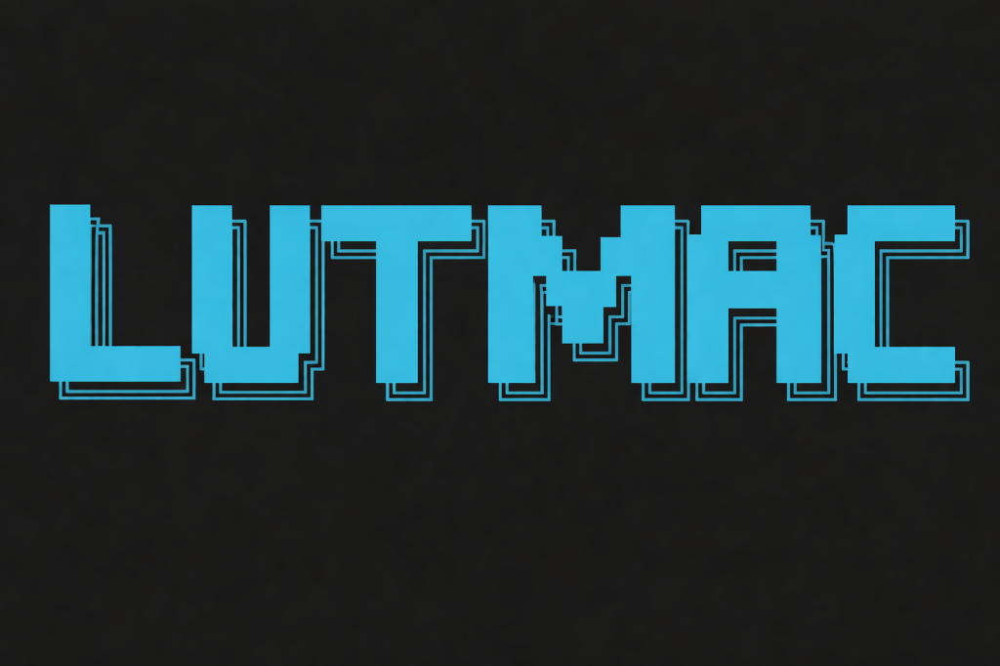

<p align="center">
  
</p>

# LutMac: Bit-Serial Lookup Table Engine for LLM Inference

LutMac is a high-performance C++ inference engine optimized for ultra-low-bit LLM quantization. By replacing conventional floating-point matrix multiplications with Bit-Serial Lookup Table (LUT) kernels, the engine enables efficient execution of models quantized to ternary (1.58-bit), binary (1-bit), and other sub-byte precisions.

## Status and Contribution Note

This project is currently in an experimental phase. While initial testing with models such as Llama 3.2 1B and Qwen 2.5 has yielded promising results in terms of throughput and coherence, further architectural refinements and performance optimizations are ongoing. 

Development is active, and contributions from the community are highly encouraged. Whether you are interested in kernel optimization, quantization research, or expanding model support, please feel free to open issues or submit pull requests.

Traditional inference frameworks typically dequantize weights to higher precision (FP16 or BF16) during the compute phase. LutMac maintains computation within the bit-serial domain. By precomputing the sums of activation groups and utilizing weight bits as indices into a lookup table, LutMac implements a multiplication-free matrix-vector product. This architectural approach significantly reduces computational overhead on CPUs, particularly in environments constrained by memory bandwidth.

## Technical Specifications

### Implementation Details
*   **Bit-Serial Acceleration**: Optimized kernels for ARM NEON and x86 AVX2, utilizing specialized table-lookup instructions such as `TBL` and `VPERMI2B`.
*   **Incoherence Processing**: Integration of Hadamard Rotation to distribute activation outliers, facilitating high-fidelity 1-bit and 2-bit quantization.
*   **Recursive Residual Quantization (RRQ)**: Advanced error-minimization techniques for 2-bit and 3-bit weight distributions.
*   **Llama 3.2 Compatibility**: Full support for Llama 3.2 architectural requirements, including Rotary Positional Embedding (RoPE) frequency scaling and 128k vocabulary support.
*   **Multi-Precision Support**: Configurable quantization levels across 1, 1.58 (Ternary), 2, 3, 4, and 8-bit widths.

## Performance Analysis

Performance benchmarks conducted on Apple M4 Pro hardware:

| Model | File Size | Precision | Throughput | Inference Quality |
| :--- | :--- | :--- | :--- | :--- |
| **Llama-3.2-1B** | 733 MB | 4-bit | 35 tokens/s | High |
| **Qwen-2.5-1.5B** | 871 MB | 4-bit | 25 tokens/s | High |
| **TinyLlama-1.1B** | 604 MB | 4-bit | 42 tokens/s | High |
| **FunctionGemma** | 251 MB | 4-bit | 75 tokens/s | Moderate |

## Core Architectural Components

The LutMac engine is engineered around significant advancements in quantization research:

1.  **Bit-Plane Decomposition**: $n$-bit weights are decomposed into $n$ separate bit-planes. For each group of four activations, sixteen possible sums are precomputed. Bit-planes are then used to index these sums, replacing iterative multiplications with direct memory lookups and additions.
2.  **Fast Walsh-Hadamard Transform (FWHT)**: To mitigate the impact of extreme outliers in LLM activations, an FWHT is applied to both weights and activations. This rotation of the feature space ensures a more uniform distribution, substantially improving quantization accuracy in sub-2-bit regimes.
3.  **Tied Embedding Optimization**: Optimized lookup and on-the-fly dequantization for high-capacity embedding layers, maintaining a reduced memory footprint while ensuring rapid model initialization.

## Installation

### Prerequisites
*   CMake 3.15 or higher
*   C++17 compliant compiler (Clang, GCC, or MSVC)
*   Hardware support for ARM NEON or x86 AVX2

### Build System
```bash
mkdir build && cd build
cmake .. -DCMAKE_BUILD_TYPE=Release
make -j$(nproc)
```

## Usage

### Quantization Procedure
The quantization tool accepts standard `.safetensors` model files.
```bash
./build/lutmac-quantize \
    --input ./models/llama-3.2-1b/model.safetensors \
    --output ./models/llama-1b-4bit.lutmac \
    --bits 4
```

### Inference Execution
```bash
./build/lutmac-inference \
    --model ./models/llama-1b-4bit.lutmac \
    --tokenizer ./models/llama-3.2-1b/tokenizer.json \
    --prompt "Provide a technical summary of quantum entanglement." \
    --max-tokens 200 \
    --streaming
```

## Project Directory Structure
*   `src/kernels/`: Implementations of Bit-serial LUT kernels (NEON/AVX).
*   `src/layers/`: Standard Transformer architecture components.
*   `src/model.cpp`: Model graph orchestration and loading logic.
*   `include/`: API definitions and core data structures.

## References
*   BitNet: Scaling 1-bit Transformers for Large Language Models
*   T-MAC: Optimized 1-bit Training and Inference
*   QuIP: Post-training Quantization with Incoherence Processing

## License
Distributed under the MIT License. Copyright (c) 2025 YASSERRMD.
